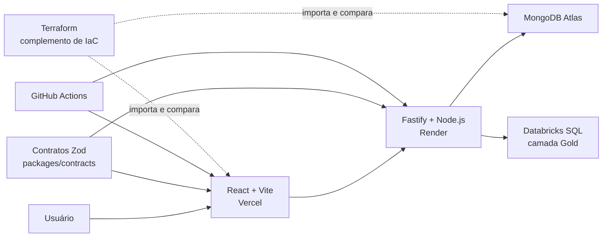

# Credit Decision Hub

Case full-stack de arquitetura para acompanhamento e análise de propostas de
crédito fictícias. O projeto demonstra como contratos compartilhados, regras de
negócio, interface, persistência, analytics, testes, CI/CD e infraestrutura
podem evoluir juntos dentro de um monorepo.

> Este é um projeto educacional e de portfólio. Os dados e critérios de decisão
> são fictícios e não representam um motor financeiro real.

## Demonstração publicada

- Front-end: <https://credit-decision-hub-web.vercel.app>
- API: <https://credit-decision-api.onrender.com>
- Health check: <https://credit-decision-api.onrender.com/health>
- Swagger UI: <https://credit-decision-api.onrender.com/documentation/>

A API utiliza o plano gratuito do Render e pode entrar em suspensão quando fica
sem uso. A primeira requisição pode levar cerca de um minuto; a interface trata
esse cold start com uma mensagem específica.

As áreas autenticadas não possuem credenciais públicas no repositório. Para uma
demonstração em entrevista, utilize previamente um usuário fictício criado no
ambiente da POC.

## Arquitetura



O Render continua declarado pelo `render.yaml`. O Terraform importa e compara
recursos existentes da Vercel e do Atlas sem disputar a propriedade do serviço
com o Blueprint do Render.

## Stack e organização

```text
apps/
├── web/         React, React Router, Formik, Tailwind CSS e Vitest
├── api/         Fastify, Mongoose, Zod, Swagger e Vitest
└── storybook/   catálogo dos componentes compartilhados
packages/
├── contracts/   schemas Zod e tipos inferidos usados pelo front e pela API
├── ui/          componentes e tokens de tema compartilhados
├── eslint-config/
└── typescript-config/
databricks/      notebook PySpark e pipeline Bronze, Silver e Gold
infrastructure/
└── terraform/   configuração declarativa da Vercel e do Atlas
context/         requisitos, SDD, decisões e histórico das tarefas
```

O monorepo usa pnpm workspaces e Turborepo para coordenar dependências, builds,
testes, lint e typecheck.

## O que este case demonstra

### Arquitetura e código

- contratos Zod definidos uma vez e consumidos pelo front-end, API e testes;
- TypeScript estrito e separação por responsabilidades;
- módulos de clientes, propostas, usuários, dashboard, auditoria e analytics;
- regras de decisão isoladas da camada HTTP e da persistência;
- autenticação com JWT em cookie `HttpOnly`, autorização por papel e CORS
  restrito;
- biblioteca de UI com temas claro/escuro, internacionalização PT-BR/EN e
  documentação no Storybook;
- testes comportamentais no front-end e endpoints testados com
  `Fastify.inject()`.

### Dados e analytics

- MongoDB Atlas como banco operacional;
- seed reproduzível com 500 clientes e 1.000 propostas fictícias;
- exportação NDJSON validada pelo mesmo contrato compartilhado;
- processamento PySpark em camadas Bronze, Silver e Gold;
- indicadores analíticos consultados pela API na Databricks Statement
  Execution API.

### Implantação e operação

- front-end na Vercel, API no Render Free e banco no MongoDB Atlas;
- GitHub Actions executando instalação congelada, lint, tipos, testes e build;
- health check, Swagger, HTTPS, logs e tratamento de cold start;
- acesso ao Atlas limitado aos CIDRs de saída do Render;
- segredos mantidos fora do Git;
- Terraform usado depois da POC para demonstrar importação, state, plan,
  detecção de drift e `prevent_destroy`, sem executar alterações destrutivas.

### Processo e documentação

- desenvolvimento incremental organizado por tarefas `CDH-001` a `CDH-017`;
- SDD como registro do desenho técnico e das decisões arquiteturais;
- router de tarefas com escopo, evidências, comandos e critérios de conclusão;
- decisões de produto e tecnologia centralizadas em poucos documentos
  canônicos.

## Roteiro para demonstrar em uma entrevista

### 1. Apresentar o problema e a arquitetura

Explique que o objetivo não é simular um banco real, mas demonstrar uma
plataforma full-stack com fronteiras claras. Mostre o diagrama acima e destaque:

- React não acessa o banco diretamente;
- Fastify concentra regras, segurança e integrações;
- MongoDB atende o fluxo operacional;
- Databricks atende processamento analítico;
- Zod conecta as fronteiras sem duplicar tipos manualmente.

### 2. Validar a implantação pública

1. Abra o front-end e observe o estado de conexão com a API.
2. Acesse `/health` para comprovar que a API está ativa.
3. Abra o Swagger e mostre os contratos HTTP.
4. Entre com o usuário fictício preparado para a demonstração.

### 3. Percorrer o fluxo funcional

1. Consulte clientes e abra seus detalhes.
2. Cadastre um cliente fictício.
3. Crie uma proposta e mostre a decisão automática.
4. Use filtros navegáveis e abra o histórico da proposta.
5. Registre uma decisão manual permitida.
6. Mostre dashboard, auditoria e indicadores analíticos.
7. Se estiver como administrador, mostre a gestão de analistas e as diferenças
   de permissão.

### 4. Mostrar qualidade e DX

Na raiz do projeto, execute:

```powershell
pnpm install --frozen-lockfile
pnpm lint
pnpm typecheck
pnpm test
pnpm build
```

Os mesmos gates fazem parte do GitHub Actions. Mostre também:

```powershell
pnpm storybook
```

O Storybook abre o catálogo da biblioteca `packages/ui`.

### 5. Explicar o Terraform

Mostre `infrastructure/terraform` e explique:

- os recursos já existiam antes do Terraform;
- `import` associou código, state local e recursos reais;
- o primeiro `plan` encontrou substituições indesejadas;
- `prevent_destroy` bloqueou o risco;
- após alinhar a configuração, o plano ficou com zero criações e zero
  destruições;
- nenhum `apply` foi necessário para cumprir o objetivo educacional.

### 6. Encerrar com os trade-offs

- Render Free reduz custo, mas introduz cold start;
- state Terraform local é suficiente para o exercício individual, mas uma
  equipe deveria usar backend e runner remotos;
- Databricks demonstra o pipeline analítico, embora seja mais infraestrutura do
  que uma POC pequena precisaria;
- contratos compartilhados reduzem divergência, mas continuam separados dos
  modelos de persistência;
- o domínio é fictício e não deve ser apresentado como decisão de crédito real.

## Executar localmente

### Pré-requisitos

- Node.js `>=22.13.0 <23`;
- pnpm `>=10.26.0`;
- acesso a uma instância MongoDB.

Instale as dependências:

```powershell
pnpm install --frozen-lockfile
```

Copie `apps/api/.env.example` para `apps/api/.env` e configure pelo menos
`MONGODB_URI`, `MONGODB_DATABASE` e `AUTH_JWT_SECRET`. Para desenvolvimento, o
front-end utiliza o proxy local do Vite; `apps/web/.env` só é necessário quando
uma URL de API diferente precisar ser informada.

Inicie todas as aplicações de desenvolvimento pelo Turborepo:

```powershell
pnpm dev
```

Endereços locais padrão:

- front-end: <http://localhost:5173>;
- API: <http://localhost:3333>;
- health check: <http://localhost:3333/health>;
- Swagger UI: <http://localhost:3333/documentation/>.

O Storybook é iniciado separadamente quando necessário:

```powershell
pnpm storybook
```

Comandos de escrita como bootstrap administrativo e seed exigem variáveis
explícitas de confirmação. Consulte os exemplos do ambiente antes de executá-los
e nunca use dados reais.

## Documentação técnica

A documentação canônica está centralizada em:

- [`context/README.md`](./context/README.md): produto, domínio, stack e fases;
- [`context/SDD.md`](./context/SDD.md): arquitetura, fronteiras e decisões;
- [`context/PROJECT-TASKS.md`](./context/PROJECT-TASKS.md): evolução incremental
  e evidências de cada entrega.

Essa separação permite apresentar não apenas o código final, mas também o
raciocínio, os trade-offs e a evolução arquitetural do projeto.
