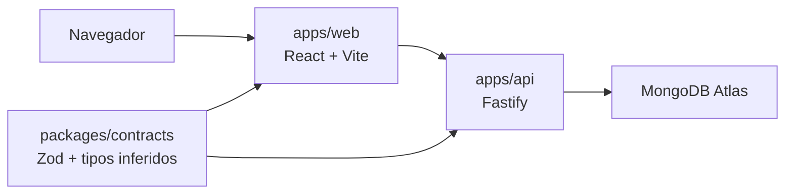
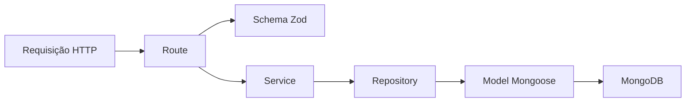

# Software Design Document

## 1. Propósito

Este documento descreve como o **Credit Decision Hub** é construído e quais decisões técnicas orientam sua evolução.

Ele complementa:

- o [`README.md`](./README.md), fonte das decisões de produto, domínio, stack e fases;
- o [`PROJECT-TASKS.md`](./PROJECT-TASKS.md), fonte do estado operacional e da ordem de execução.

Este SDD registra somente o que já foi decidido ou implementado. Uma ideia futura não deve ser apresentada como arquitetura atual.

Neste arquivo, SDD significa **Software Design Document**. O fluxo formado por especificação, tarefa, implementação e evidência também adota uma abordagem de **Spec-Driven Development**: decisões relevantes são explicitadas e aprovadas antes do código.

## 2. Estado atual

Data de referência: 29 de julho de 2026.

Implementado:

- fundação do monorepo;
- aplicação React com integração ao `GET /health`;
- API Fastify;
- contratos compartilhados de health e clientes;
- conexão configurável com MongoDB Atlas;
- criação, listagem paginada e consulta de clientes.

Em definição:

- regras objetivas para classificação e decisão de propostas.

Não implementado:

- propostas;
- seed;
- Swagger / OpenAPI;
- telas de clientes e propostas;
- autenticação;
- dashboard;
- Databricks;
- infraestrutura e CI/CD.

## 3. Visão da arquitetura

O front-end acessa dados apenas pela API. O pacote de contratos é reutilizado pelos dois lados e não conhece detalhes de interface, Fastify, Mongoose ou banco de dados.

## 4. Organização do monorepo

### `apps/web`

Responsável por:

- rotas e interface;
- estado e validação de formulários;
- consumo da API;
- feedback de carregamento, sucesso e erro;
- testes de comportamento da interface.

### `apps/api`

Responsável por:

- configuração do Fastify;
- endpoints HTTP;
- regras de negócio;
- persistência no MongoDB;
- configuração do ambiente;
- testes de services e endpoints.

### `packages/contracts`

Responsável por:

- schemas Zod de entrada e saída;
- parâmetros de rota e query;
- enums compartilhados;
- tipos TypeScript inferidos com `z.infer`.

Um tipo de contrato não deve ser escrito manualmente em outra aplicação.

### Pacotes de configuração

- `packages/typescript-config` centraliza configurações TypeScript;
- `packages/eslint-config` centraliza regras do ESLint;
- Turborepo coordena `dev`, `build`, `test`, `lint` e `typecheck`.

## 5. Fluxo do back-end

Para módulos com regra de negócio e persistência, o fluxo adotado é:

Responsabilidades:

- **route:** valida o contrato HTTP, traduz erros conhecidos e monta a resposta;
- **service:** aplica regras de negócio sem depender diretamente do Mongoose;
- **repository:** consulta e persiste dados, convertendo documentos para contratos da aplicação;
- **model:** define a forma de persistência e os índices da collection.

Controller separado só deve existir quando houver responsabilidade própria. Para uma simples delegação entre route e service, ele adicionaria uma camada sem comportamento.

O service recebe o repository por dependência, permitindo testes isolados e mantendo a regra de negócio desacoplada da persistência.

## 6. Contratos e persistência

Zod e Mongoose têm responsabilidades diferentes:

- Zod é a fonte do contrato da aplicação e dos tipos compartilhados;
- Mongoose define o documento persistido, restrições e consultas do MongoDB.

O repository faz a conversão explícita entre essas fronteiras e valida sua saída com o schema compartilhado quando necessário. Essa duplicação estrutural entre contrato e persistência é intencional: cada camada protege uma fronteira diferente.

Regras:

- inferir tipos de contratos com `z.infer`;
- não usar `any`;
- normalizar dados na entrada quando isso fizer parte do contrato;
- nunca expor documentos Mongoose diretamente;
- respostas externas devem respeitar os contratos compartilhados.

## 7. Inicialização da API

O processo de inicialização segue esta ordem:

1. criar a instância Fastify;
2. carregar `.env` e `.env.local`, quando existirem;
3. validar as variáveis com Zod;
4. configurar servidores DNS opcionais;
5. conectar ao MongoDB;
6. iniciar o servidor HTTP.

`app.ts` constrói a aplicação sem abrir porta ou conectar ao banco. `server.ts` coordena recursos externos. Essa separação permite testar endpoints com `Fastify.inject()` sem subir servidor real.

Configuração atual:

- `PORT`, padrão `3333`;
- `MONGODB_URI`, obrigatória;
- `MONGODB_DATABASE`, padrão `credit-decision-hub`;
- `MONGODB_DNS_SERVERS`, opcional e destinado a ambientes com problema de resolução DNS.

Segredos ficam somente em arquivos locais ignorados pelo Git. O repositório contém apenas `.env.example`.

## 8. Módulo de clientes

### Contratos

Campos atuais:

- `id`;
- `name`;
- `document`;
- `email`;
- `phone`;
- `monthlyIncome`;
- `occupation`;
- `createdAt`.

Documento e e-mail são únicos na persistência. A entrada é normalizada pelo schema Zod.

### Endpoints

| Método | Rota | Comportamento |
| --- | --- | --- |
| `POST` | `/customers` | Cria um cliente |
| `GET` | `/customers?page=1&limit=20` | Lista clientes com paginação |
| `GET` | `/customers/:id` | Consulta um cliente |

A listagem ordena os registros mais recentes primeiro. O limite máximo por página é `100`.

### Erros conhecidos

| Status | Situação |
| --- | --- |
| `400` | Corpo, query ou parâmetro inválido |
| `404` | Cliente não encontrado |
| `409` | Documento ou e-mail já cadastrado |

Erros inesperados são delegados ao tratamento padrão do Fastify. Um contrato global de erros ainda não foi definido.

## 9. Módulo de propostas

O domínio inicial, os status e os níveis de risco estão definidos no `README.md`, mas as regras ainda são qualitativas.

Antes da implementação, devem ser decididos e aprovados:

- limites objetivos de score;
- limite aceitável de comprometimento de renda;
- critério de valor elevado;
- condições que levam à análise manual;
- condições determinísticas de documentação pendente;
- inconsistências que representam suspeita de fraude;
- precedência quando mais de uma condição for verdadeira;
- transições de status permitidas;
- conteúdo mínimo do histórico de decisão.

Nenhum valor deve ser inventado durante a implementação. A tarefa ativa no router conduz essa definição.

## 10. Estratégia de testes

### Contratos

- validar entradas aceitas e rejeitadas;
- confirmar normalização e coerção;
- validar formatos de resposta.

### API

- testar services com dependências substituídas por mocks tipados;
- testar rotas com `Fastify.inject()`;
- não abrir porta nem exigir banco real em testes unitários;
- testar conexão e configuração externa por mocks;
- usar integração real apenas como smoke test explícito e sem persistir segredos.

### Front-end

- usar Vitest e React Testing Library;
- consultar a interface com `screen`;
- testar comportamento e estados visíveis;
- evitar snapshots;
- usar descrições iniciadas por `should`.

## 11. Requisitos não funcionais

- TypeScript estrito;
- funções pequenas e responsabilidades únicas;
- composição e injeção de dependência quando resolvem acoplamento real;
- imports e nomes claros;
- nenhuma dependência sem necessidade concreta;
- dados exclusivamente fictícios;
- segredos fora do Git;
- paginação em coleções;
- mudanças pequenas, testáveis e revisáveis;
- nenhuma tecnologia de fase futura antecipada.

## 12. Registro de decisões

| Data | Decisão | Motivo |
| --- | --- | --- |
| 2026-07-29 | Usar pnpm workspaces e Turborepo | Coordenar aplicações e pacotes com scripts compartilhados |
| 2026-07-29 | Usar Zod como fonte dos contratos compartilhados | Evitar tipos manuais divergentes entre front-end e API |
| 2026-07-29 | Separar contrato Zod de persistência Mongoose | Proteger as fronteiras da aplicação e do banco |
| 2026-07-29 | Separar `app.ts` de `server.ts` | Permitir testes sem porta e controlar recursos externos |
| 2026-07-29 | Organizar módulos com route, service, repository e model quando necessário | Manter responsabilidades claras sem abstrações genéricas |
| 2026-07-29 | Não criar controller de passagem | Evitar uma camada sem responsabilidade própria |
| 2026-07-29 | Usar injeção estrutural do repository no service | Aplicar inversão de dependência e facilitar testes |
| 2026-07-29 | Manter segredos em arquivos locais ignorados | Evitar exposição de credenciais |
| 2026-07-29 | Manter decisões, desenho e execução em três documentos canônicos | Evitar mistura entre produto, arquitetura e estado operacional |

## 13. Atualização deste documento

Atualizar o SDD quando uma decisão técnica:

- alterar uma fronteira ou fluxo;
- estabelecer um novo padrão reutilizável;
- substituir uma decisão registrada;
- resolver uma questão técnica aberta.

Não usar o SDD como diário de implementação ou lista de tarefas. O histórico operacional pertence ao `PROJECT-TASKS.md` e ao Git.
