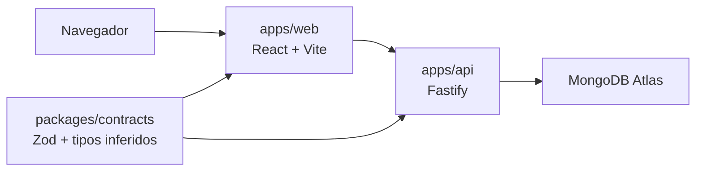
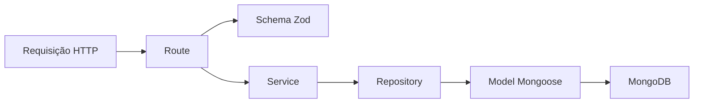

# Software Design Document

## 1. Propósito

Este documento descreve como o **Credit Decision Hub** é construído e quais decisões técnicas orientam sua evolução.

Ele complementa:

- o [`README.md`](./README.md), fonte das decisões de produto, domínio, stack e fases;
- o [`PROJECT-TASKS.md`](./PROJECT-TASKS.md), fonte do estado operacional e da ordem de execução.

Este SDD registra somente o que já foi decidido ou implementado. Uma ideia futura não deve ser apresentada como arquitetura atual.

Neste arquivo, SDD significa **Software Design Document**. O fluxo formado por especificação, tarefa, implementação e evidência também adota uma abordagem de **Spec-Driven Development**: decisões relevantes são explicitadas e aprovadas antes do código.

## 2. Estado atual

Data de referência: 29 de julho de 2026.

Implementado:

- fundação do monorepo;
- aplicação React com integração ao `GET /health`;
- API Fastify;
- contratos compartilhados de health e clientes;
- conexão configurável com MongoDB Atlas;
- criação, listagem paginada e consulta de clientes;
- contratos compartilhados e persistência de propostas.

Definido:

- regras objetivas para classificação e decisão de propostas, ainda sem implementação.

Em execução:

- motor de decisão, repository, service e endpoints de propostas.

Não implementado:

- endpoints de propostas;
- seed;
- Swagger / OpenAPI;
- telas de clientes e propostas;
- autenticação;
- dashboard;
- Databricks;
- infraestrutura e CI/CD.

## 3. Visão da arquitetura



O front-end acessa dados apenas pela API. O pacote de contratos é reutilizado pelos dois lados e não conhece detalhes de interface, Fastify, Mongoose ou banco de dados.

## 4. Organização do monorepo

### `apps/web`

Responsável por:

- rotas e interface;
- estado e validação de formulários;
- consumo da API;
- feedback de carregamento, sucesso e erro;
- testes de comportamento da interface.

### `apps/api`

Responsável por:

- configuração do Fastify;
- endpoints HTTP;
- regras de negócio;
- persistência no MongoDB;
- configuração do ambiente;
- testes de services e endpoints.

### `packages/contracts`

Responsável por:

- schemas Zod de entrada e saída;
- parâmetros de rota e query;
- enums compartilhados;
- tipos TypeScript inferidos com `z.infer`.

Um tipo de contrato não deve ser escrito manualmente em outra aplicação.

### Pacotes de configuração

- `packages/typescript-config` centraliza configurações TypeScript;
- `packages/eslint-config` centraliza regras do ESLint;
- Turborepo coordena `dev`, `build`, `test`, `lint` e `typecheck`.

## 5. Fluxo do back-end

Para módulos com regra de negócio e persistência, o fluxo adotado é:



Responsabilidades:

- **route:** valida o contrato HTTP, traduz erros conhecidos e monta a resposta;
- **service:** aplica regras de negócio sem depender diretamente do Mongoose;
- **repository:** consulta e persiste dados, convertendo documentos para contratos da aplicação;
- **model:** define a forma de persistência e os índices da collection.

Controller separado só deve existir quando houver responsabilidade própria. Para uma simples delegação entre route e service, ele adicionaria uma camada sem comportamento.

O service recebe o repository por dependência, permitindo testes isolados e mantendo a regra de negócio desacoplada da persistência.

## 6. Contratos e persistência

Zod e Mongoose têm responsabilidades diferentes:

- Zod é a fonte do contrato da aplicação e dos tipos compartilhados;
- Mongoose define o documento persistido, restrições e consultas do MongoDB.

O repository faz a conversão explícita entre essas fronteiras e valida sua saída com o schema compartilhado quando necessário. Essa duplicação estrutural entre contrato e persistência é intencional: cada camada protege uma fronteira diferente.

Regras:

- inferir tipos de contratos com `z.infer`;
- não usar `any`;
- normalizar dados na entrada quando isso fizer parte do contrato;
- nunca expor documentos Mongoose diretamente;
- respostas externas devem respeitar os contratos compartilhados.

## 7. Inicialização da API

O processo de inicialização segue esta ordem:

1. criar a instância Fastify;
2. carregar `.env` e `.env.local`, quando existirem;
3. validar as variáveis com Zod;
4. configurar servidores DNS opcionais;
5. conectar ao MongoDB;
6. iniciar o servidor HTTP.

`app.ts` constrói a aplicação sem abrir porta ou conectar ao banco. `server.ts` coordena recursos externos. Essa separação permite testar endpoints com `Fastify.inject()` sem subir servidor real.

Configuração atual:

- `PORT`, padrão `3333`;
- `MONGODB_URI`, obrigatória;
- `MONGODB_DATABASE`, padrão `credit-decision-hub`;
- `MONGODB_DNS_SERVERS`, opcional e destinado a ambientes com problema de resolução DNS.

Segredos ficam somente em arquivos locais ignorados pelo Git. O repositório contém apenas `.env.example`.

## 8. Módulo de clientes

### Contratos

Campos atuais:

- `id`;
- `name`;
- `document`;
- `email`;
- `phone`;
- `monthlyIncome`;
- `occupation`;
- `createdAt`.

Documento e e-mail são únicos na persistência. A entrada é normalizada pelo schema Zod.

### Endpoints

| Método | Rota | Comportamento |
| --- | --- | --- |
| `POST` | `/customers` | Cria um cliente |
| `GET` | `/customers?page=1&limit=20` | Lista clientes com paginação |
| `GET` | `/customers/:id` | Consulta um cliente |

A listagem ordena os registros mais recentes primeiro. O limite máximo por página é `100`.

### Erros conhecidos

| Status | Situação |
| --- | --- |
| `400` | Corpo, query ou parâmetro inválido |
| `404` | Cliente não encontrado |
| `409` | Documento ou e-mail já cadastrado |

Erros inesperados são delegados ao tratamento padrão do Fastify. Um contrato global de erros ainda não foi definido.

## 9. Módulo de propostas

As regras abaixo foram aprovadas em 29 de julho de 2026. São exclusivamente didáticas e não representam política real de crédito.

### 9.1 Dados da avaliação

A criação de uma proposta recebe:

- cliente;
- valor solicitado, maior que zero;
- quantidade de parcelas, entre `1` e `60`;
- score fictício, entre `0` e `1000`;
- indicador de documentação completa;
- lista de indícios de fraude.

Os indícios aceitos inicialmente são:

- `document_mismatch`;
- `identity_mismatch`;
- `duplicate_application`.

O front-end não informa o comprometimento de renda. A API o calcula usando a renda mensal persistida do cliente, evitando divergência entre um valor informado e os dados usados na decisão.

### 9.2 Parcela e comprometimento

Nesta fase, a parcela é uma estimativa didática sem juros:

```txt
parcela estimada = valor solicitado / quantidade de parcelas
comprometimento (%) = parcela estimada / renda mensal * 100
```

A parcela e o percentual são arredondados para duas casas decimais. O percentual arredondado é usado na classificação.

Quando a renda mensal for zero:

- a parcela estimada ainda pode ser calculada;
- o comprometimento será `null`, porque a divisão não possui resultado representável;
- o risco será `high`;
- a proposta será reprovada com o motivo de renda indisponível.

Quantidade de parcelas e valor solicitado são imutáveis após a decisão automática. Uma alteração futura deve criar uma nova simulação ou reavaliação e gerar histórico; não deve sobrescrever silenciosamente a decisão original.

Taxa de juros, CET e sistemas de amortização não fazem parte da Fase 2. A fórmula deve ficar em uma função pura e testável para permitir evolução posterior. A inclusão de juros exigirá uma nova decisão de domínio, pois altera parcela, comprometimento, risco e resultado.

### 9.3 Classificação de risco

Risco por score:

| Score | Risco |
| ---: | --- |
| `700` a `1000` | `low` |
| `500` a `699` | `medium` |
| `0` a `499` | `high` |

Risco por comprometimento:

| Comprometimento | Risco |
| ---: | --- |
| até `30%` | `low` |
| acima de `30%` até `40%` | `medium` |
| acima de `40%` | `high` |
| indisponível por renda zero | `high` |

O risco final é sempre o pior nível encontrado entre score e comprometimento. O valor solicitado não muda o risco; ele pode mudar o fluxo operacional para análise manual.

### 9.4 Precedência da decisão

As condições são avaliadas nesta ordem e a primeira correspondência define o resultado:

| Ordem | Condição | Status | Motivo |
| ---: | --- | --- | --- |
| 1 | Existe ao menos um indício de fraude | `fraud_suspected` | `fraud_signal_detected` |
| 2 | Documentação está incompleta | `pending_documents` | `documents_incomplete` |
| 3 | Renda mensal é zero | `rejected` | `income_unavailable` |
| 4 | Risco final é alto | `rejected` | `high_risk` |
| 5 | Valor solicitado é maior que R$ 100.000,00 | `manual_review` | `high_amount` |
| 6 | Risco final é médio | `manual_review` | `medium_risk` |
| 7 | Risco final é baixo | `approved` | `eligible` |

R$ 100.000,00 exatos não são considerados valor elevado. Indício de fraude prevalece sobre documentação incompleta e todas as regras de risco.

### 9.5 Ciclo de status e histórico

Toda proposta inicia logicamente como `pending`. A avaliação automática registra a criação e a transição para o status calculado.

Conteúdo mínimo de cada evento de histórico:

- identificador;
- status anterior, nulo somente no evento de criação;
- novo status;
- código do motivo;
- descrição legível;
- tipo do responsável: `system` ou `analyst`;
- identificador do responsável, obrigatório para `analyst`;
- data e hora.

Transições previstas:

- `pending` pode ir para qualquer resultado da avaliação automática;
- `pending_documents` pode voltar para `pending` após atualização documental e nova avaliação;
- `manual_review` pode ir para `approved` ou `rejected`;
- `fraud_suspected` pode ir para `manual_review` ou `rejected`;
- `approved` e `rejected` são estados finais.

Na Fase 2 será implementada somente a decisão automática inicial. Transições manuais dependem de um usuário autenticado e ficam para a fase de autenticação e permissões. Isso impede aceitar uma identidade de analista não verificada apenas para antecipar funcionalidade.

### 9.6 Exemplos e fronteiras

| Cenário | Resultado |
| --- | --- |
| Score `700`, comprometimento `30%` e R$ 100.000,00 | `approved` |
| Score `699` e comprometimento `30%` | `manual_review` |
| Score `700` e comprometimento `30,01%` | `manual_review` |
| Score `500` e comprometimento `40%` | `manual_review` |
| Score `499` ou comprometimento `40,01%` | `rejected` |
| Baixo risco e R$ 100.000,01 | `manual_review` |
| Documentação incompleta e alto risco | `pending_documents` |
| Fraude e documentação incompleta | `fraud_suspected` |
| Renda mensal zero, sem fraude e com documentos completos | `rejected` |

### 9.7 Contratos e persistência

Os contratos de propostas são divididos por responsabilidade:

- `proposal.values.ts` mantém os valores canônicos dos enums;
- `proposal-history.schema.ts` define status, motivos, responsáveis e eventos;
- `proposal.schema.ts` define entrada, resposta, parâmetros e filtros;
- `index.ts` expõe a API pública do domínio.

Todos os tipos públicos são inferidos dos schemas Zod. Os arrays canônicos de status, risco, motivos, indícios e responsáveis também são consumidos pelo Mongoose, evitando listas de valores duplicadas entre contrato e persistência.

O contrato de criação é estrito e recebe somente dados informados pelo usuário. Ele rejeita comprometimento, risco, status, decisão e histórico, pois esses campos pertencem ao motor de decisão.

O contrato de resposta:

- exige ao menos um evento de histórico;
- exige que o primeiro evento represente a criação;
- exige que status e motivo atuais correspondam ao último evento;
- exige histórico em ordem cronológica;
- diferencia por tipo o responsável `system` do `analyst`;
- exige `actorId` quando o responsável for um analista;
- rejeita propriedades externas ao contrato.

Os filtros compartilhados suportam cliente, status, risco, período, faixa de valor e paginação. Intervalos invertidos são rejeitados no contrato.

O model Mongoose:

- mantém valor, parcelas e score imutáveis;
- representa histórico como subdocumentos;
- reutiliza os valores canônicos exportados pelos contratos;
- valida valores positivos, inteiros, enums e indícios sem duplicação;
- cria índices compostos para cliente, status e risco por data;
- cria índice para faixa de valor;
- infere `ProposalPersistence` com `InferSchemaType`.

O model não é exportado pelo pacote de contratos e documentos Mongoose não fazem parte das respostas da API. A conversão explícita será responsabilidade do repository.

## 10. Estratégia de testes

### Contratos

- validar entradas aceitas e rejeitadas;
- confirmar normalização e coerção;
- validar formatos de resposta.

### API

- testar services com dependências substituídas por mocks tipados;
- testar rotas com `Fastify.inject()`;
- não abrir porta nem exigir banco real em testes unitários;
- testar conexão e configuração externa por mocks;
- usar integração real apenas como smoke test explícito e sem persistir segredos.

### Front-end

- usar Vitest e React Testing Library;
- consultar a interface com `screen`;
- testar comportamento e estados visíveis;
- evitar snapshots;
- usar descrições iniciadas por `should`.

## 11. Requisitos não funcionais

- TypeScript estrito;
- funções pequenas e responsabilidades únicas;
- composição e injeção de dependência quando resolvem acoplamento real;
- imports e nomes claros;
- nenhuma dependência sem necessidade concreta;
- dados exclusivamente fictícios;
- segredos fora do Git;
- paginação em coleções;
- mudanças pequenas, testáveis e revisáveis;
- nenhuma tecnologia de fase futura antecipada.

## 12. Registro de decisões

| Data | Decisão | Motivo |
| --- | --- | --- |
| 2026-07-29 | Usar pnpm workspaces e Turborepo | Coordenar aplicações e pacotes com scripts compartilhados |
| 2026-07-29 | Usar Zod como fonte dos contratos compartilhados | Evitar tipos manuais divergentes entre front-end e API |
| 2026-07-29 | Separar contrato Zod de persistência Mongoose | Proteger as fronteiras da aplicação e do banco |
| 2026-07-29 | Separar `app.ts` de `server.ts` | Permitir testes sem porta e controlar recursos externos |
| 2026-07-29 | Organizar módulos com route, service, repository e model quando necessário | Manter responsabilidades claras sem abstrações genéricas |
| 2026-07-29 | Não criar controller de passagem | Evitar uma camada sem responsabilidade própria |
| 2026-07-29 | Usar injeção estrutural do repository no service | Aplicar inversão de dependência e facilitar testes |
| 2026-07-29 | Manter segredos em arquivos locais ignorados | Evitar exposição de credenciais |
| 2026-07-29 | Manter decisões, desenho e execução em três documentos canônicos | Evitar mistura entre produto, arquitetura e estado operacional |
| 2026-07-29 | Adotar regras determinísticas e didáticas para propostas | Permitir implementação testável sem representar um motor financeiro real |
| 2026-07-29 | Calcular comprometimento na API com parcela sem juros nesta fase | Manter uma única fonte para o cálculo e postergar complexidade financeira não especificada |
| 2026-07-29 | Adiar transições manuais até existir identidade autenticada | Preservar a responsabilidade e a integridade do histórico |
| 2026-07-29 | Separar valores, histórico e schemas de propostas dentro do domínio de contratos | Melhorar leitura e coesão sem criar abstrações genéricas |
| 2026-07-29 | Reutilizar no Mongoose os valores canônicos exportados pelos contratos | Impedir divergência entre enums de aplicação e persistência |
| 2026-07-29 | Validar coerência entre a proposta e seu último evento no contrato de resposta | Evitar estado atual incompatível com a trilha de decisão |

## 13. Atualização deste documento

Atualizar o SDD quando uma decisão técnica:

- alterar uma fronteira ou fluxo;
- estabelecer um novo padrão reutilizável;
- substituir uma decisão registrada;
- resolver uma questão técnica aberta.

Não usar o SDD como diário de implementação ou lista de tarefas. O histórico operacional pertence ao `PROJECT-TASKS.md` e ao Git.
